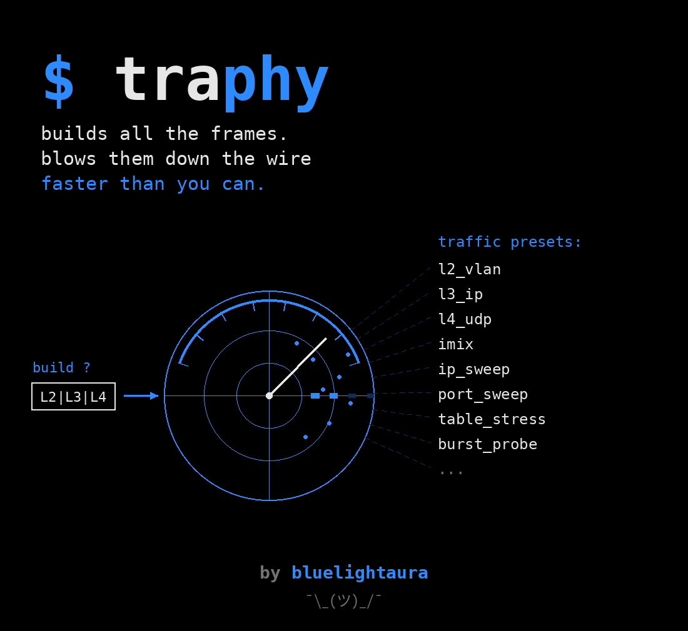

# TRaphy



[Русская версия](README_RU.md)

*traffic + Scapy*

The same thing every time: you want to see how a switch copes with a /24 sweep
of destination addresses, and once again you write a throwaway Scapy script,
once again you look up what the interface is called, once again you forget to
pad the frame to the size you asked for.

Now it goes like this: compose the frame in a menu - layer, MAC, VLAN, IP,
ports, size, what to iterate over, at what rate. Point at a device, pick the
ports out of what is actually there. Press run - the script builds itself,
ships to the host and goes, and the counters come back to the screen.

The script is not hidden. You see all of it before it runs, and you can take it
with you: an ordinary `.py` that works without TRaphy.

```
╭──────────────────────────────────────────────────────────────╮
│ ◈ TRaphy 0.1.0                                               │
│   compose traffic by hand - run it as a script               │
├──────────────────────────────────────────────────────────────┤
│ Target: root@10.0.0.9 · ens1f0                       (Scapy) │
│   ✓ reachable: bench01 · ens1f0                              │
│   Profile: ip_sweep · 1 of 1 streams · 5 000 pps             │
│   ↻ last run: ip_sweep · 2026-09-01 16:41                    │
│                                                              │
│    Configure target      host, interfaces, reachability      │
│  ▸ Compose traffic       a preset or layer by layer          │
│    Profile streams       edit, enable, ranges                │
│    Show the script       what will go to the host            │
│    Dry run               build the frames, send nothing      │
│    Run                   push traffic and watch counters     │
│    Save the script       drop a .py next to you              │
│    Run history           what ran and when                   │
│    Language              EN                                  │
│    Theme                 dark                                │
│                                                              │
│   ↑/↓ select   ↵ run   q quit                                │
╰──────────────────────────────────────────────────────────────╯
```

## How it works

1. **Compose the traffic.** A preset, or step by step: layer (L2 / L3 / L4) →
   frame fields (MAC, VLAN, IP, TTL, ports, size) → what to iterate over →
   rate and mode.
2. **Set up the target.** Locally or over SSH. Press `c` and TRaphy goes to the
   machine and brings back the interface list with MAC, link state and speed,
   the Python version, whether Scapy is there and whether root is available.
   Ports are picked out of that list.
3. **Read the script.** The very file that will be shipped, not a retelling of
   the form.
4. **Run it.** The script travels to the target, runs there and streams the
   counters back line by line: tx / rx / loss / the rate actually achieved.
5. **Read the result.** The profile, the script, the event stream and the
   outcome all land in one run directory, so a number in a report can be traced
   back to the frames a week later.

## Installation

One entry point, the `start` script: it creates the environment, installs the
dependencies and launches. Nothing has to be installed by hand first.

```sh
git clone https://github.com/bluelightaura/traphy && cd traphy
./start                     # the menu
./start presets             # any command - arguments are passed through as is
```

To call it from anywhere with a single word, the way `code` or `opencode` work:

```sh
ln -s "$PWD/start" ~/.local/bin/traphy
traphy                      # the menu
traphy run ip_sweep -t bench -d 5
```

Reinstallation happens on its own once `pyproject.toml` is newer than the mark
in `.venv`; the rest of the time startup is instant.

`start` picks passwords up from `~/.config/traphy/secrets.env` when that file
exists (the path is overridden with `TRAPHY_SECRETS`) - `TRAPHY_SSH_PASSWORD`,
`TRAPHY_SUDO_PASSWORD`, `TRAPHY_IXIA_PASSWORD`. They never reach the
repository: it is public and the file lives outside it.

If you would rather build the environment yourself:

```sh
python -m venv .venv && . .venv/bin/activate
pip install -e .            # menu, model and generator - standard library only
pip install -e '.[ssh]'     # + remote targets over SSH
pip install -e '.[local]'   # + the target is this machine: Scapy is needed here then
pip install -e '.[ixia]'    # + Ixia chassis: the IxNetwork client belongs here
traphy                      # or: python -m traphy
```

**Scapy is needed on the target, not here.** The machine with the menu open
does not need it at all: TRaphy builds and shows the script without it. The
sending is done by the target, and that is where root or passwordless `sudo`
are required.

The exception is a local target, where "there" and "here" are the same machine:
then Scapy does have to be installed next to the menu, which is what the
`local` extra is for.

## From the command line

All of it, through the same functions, without the menu:

```sh
traphy presets                                  # what is available
traphy gen ip_sweep -o sweep.py                 # build a script
traphy gen ip_sweep --engine trex -o sweep.py   # the same, for TRex
traphy gen ip_sweep --engine ixia -o sweep.py   # the same, for an Ixia chassis
traphy probe -t bench                           # what is on the target: NIC, root, scapy
traphy targets                                  # the saved targets
traphy run ip_sweep -t bench -d 30              # run it
traphy run l4_tcp -t bench --dry-run --json     # build the frames, send nothing
traphy history -n 20
traphy recover -t bench                         # clean up after a run that did not
```

`recover` is there for one case: the run was killed by a signal or the SSH
session dropped, its `finally` never executed, and the machine was left with
ports held, service mode on and a live session. The next person sees a refusal
that has nothing to do with their work. It is a separate command rather than a
flag, because it is not a run at all - nothing is sent and the profile is not
involved. An engine that cannot clean up says so instead of pretending.

A saved script lives a life of its own:

```sh
sudo ./sweep.py --iface ens1f0 --rx-iface ens1f1 --duration 30
```

## Presets

| Key | What it sends | What it hits |
|---|---|---|
| `l2_ethernet` | plain Ethernet frames | switching, the MAC table |
| `l2_vlan` | tagged frames | trunks, per-VLAN forwarding |
| `l3_ip` | IPv4 | routing, the FIB |
| `l4_udp` / `l4_tcp` | UDP / TCP | ACLs, sessions, NAT |
| `imix` | 64/590/1514 at 7:4:1 | a mix that resembles live traffic |
| `ip_sweep` | a /24 sweep of destination addresses | the route table |
| `port_sweep` | a sweep of the destination port | sessions, NAT, ACLs |
| `table_stress` | random sources at a high pps | tables under load |
| `burst_probe` | queues with pauses | buffers, microbursts |

Any of them is a starting point: it opens in the stream editor and is edited
from there.

## On being honest about the numbers

A tool that prints "0% loss" when nobody counted anything is worse than
useless. So:

* **Loss is measured only when there is something to measure it with.**
  Without a receive interface the report says "receive not measured", not
  zero. On Scapy the frames carrying the run's own mark are counted - a fresh
  mark per run, so the tail of the previous one is not caught.
* **Next to the receive number it says what measured it.** There are several
  sources and they are worth different things: `flow stats` on TRex and
  `traffic item` on Ixia are counters in hardware and can go into a report as
  they are; `mark` is a sniffer catching our own signature inside the frame;
  `port counter` adds up everything that arrived, not only our frames;
  `partial` means some of the streams went out uncounted; `not measured` means
  nobody counted at all.
  A zero in the loss column that actually means "nobody looked" is the most
  expensive lie a tool like this can tell.
* **Rate is a target, not a guarantee.** Scapy through a kernel socket runs out
  of breath somewhere in the tens of thousands of frames per second. The script
  prints the rate it actually achieved, and if it is noticeably below the one
  requested, that is said out loud: the device was not tested at that rate.
* **Truncated ranges are named.** A /16 sweep is 65 thousand frames; the
  generator cuts it to 1024 and says that it did, instead of quietly sending a
  part of it.

## Engines

The traffic model is one thing, what blows it into the cable is another. The
transport, the host probe, the run archive and the menu are shared; the engine
changes only the artifact and what runs it.

| Engine | Layers | State |
|---|---|---|
| **Scapy** | L2-L4 | works: its own script, any Linux with a NIC and root |
| **TRex** | L2-L4 | works: DPDK, line rate, loss from flow stats |
| **Ixia** | L2-L4 | works: a chassis over the IxNetwork REST API, counted per traffic item |
| **JMeter** | L7 | declared: threads, requests, latencies |

One profile, any engine. A frame from the same profile goes into the cable at
the same length everywhere; that is covered by a test, because otherwise two
runs of "the same" test have nothing to compare. They count differently only
because they are built differently: Scapy pads to the size without the FCS,
TRex does the same, IxNetwork counts the size including the FCS - and the
script adds those four bytes back, so that what is in the cable is identical.

JMeter can already be selected when setting up a target and will say honestly
what it is missing on that host - but traffic cannot be pushed through it yet.
What is needed is below, under "Future releases", and in more detail in
`src/traphy/engines/jmeter.py`.

### TRex

Scapy through a kernel socket runs out of breath somewhere in the tens of
thousands of frames per second. Above that, a run describes the generator
rather than the device - and that is when DPDK pays for its complexity.

What changes once a target is switched to TRex:

* **A range is not expanded into frames.** A /16 sweep is four bytes of field
  engine configuration, not 65 536 frames in memory. Scapy cuts a range like
  that to 1024 and says it did; here there is nothing to cut, and the screen
  shows the real number.
* **Loss is counted by the hardware - and the hardware is checked too.** Every
  stream has its own flow stats group and the NIC counts its frames on the
  receive port. That is not a sniffer catching a mark inside the frame, but "in
  hardware" does not mean "correct": on a live bench the receive groups sat at
  zero over a working link, collected somebody else's frames carrying the same
  tag, and counted arrivals on a port other than ours. So the group figure is
  checked against the port counter, against an idle reading taken before the
  start, and against the daemon's own admission (`flow_stats['global']` - the
  tagged frames it filed under no group at all); a run with nothing to measure
  refuses to call itself a measurement instead of printing a tidy wrong number.
* **The receive side is reported group by group.** Every tick in
  `events.jsonl` carries the breakdown per group and per port, not only the
  sum: one poisoned group out of three looks exactly like none of them in a
  total.
* **Ports instead of interfaces - but not blind.** The NICs have been handed to
  DPDK and are gone from `/sys/class/net`; a port is addressed by index. The
  probe asks the daemon itself about each port - link, speed, driver, holder,
  service mode, acquiring nothing - and the form offers them with those
  labels. A port held by a colleague, a link that is down, and an index the
  daemon does not have are all said up front rather than mid-run.
* **Root is not needed.** The daemon was brought up with it long before us; the
  script that drives it is an ordinary client.
* **Frames are built by the Scapy from the release itself.** The field engine
  writes at offsets computed against it; a foreign Scapy would put them
  somewhere else, and the result would be traffic that looks plausible and
  tests nothing. So the script puts the release's control plane at the front of
  `sys.path`.

What TRex cannot do, and says out loud rather than silently:

| | |
|---|---|
| A frame without IP is not counted | TRex marks a group with the IP ID field; an L2 stream has no counter, and the run is marked "partial" |
| `--count` does not work | TRex sends by time; to send exactly N frames, a burst mode of N is set |
| The TCP checksum on a port sweep | is not recomputed; for UDP a zero is put there instead - a legal way of saying "not computed" |

A target is configured like this: the TRex engine, the release directory on the
host, the daemon's address and port, the numbers of the send and receive ports.
Probing the target (`c` in the form) answers with three separate answers -
whether the directory is there, whether the control plane is inside it, whether
the daemon responds - because those are three different things that are fixed
in different ways.

## What is inside

```
src/traphy/
  models.py        Profile / Stream / Packet / VMField - the whole traffic model
  presets.py       ready-made profiles
  codegen.py       Profile → a self-contained Scapy script
  codegen_stl.py   Profile → a control script for the TRex daemon
  codegen_ixnet.py Profile → a control script for an Ixia chassis
  target.py        the target: host, interfaces, engine; the target store
  transport.py     delivering the script: locally or over SSH
  probe.py         what is on the target: NIC, root, Scapy, Java
  runner.py        one run: build, ship, parse the counters, write it down
  engines/         the seam under Scapy / TRex / JMeter
  ui.py            panels, themes, key reading - standard library only
  menu.py          the launcher
  screens/         target setup, traffic composition, the run, history
```

The tests drive the sending engine against a stubbed Scapy - pacing, bursts,
interleaving streams, stepping through a range and counting the receive side
are all checked without root and without a NIC:

```sh
pip install -e '.[dev]' && pytest -q && ruff check src tests
```

## Future releases

The main thing missing here is an L7 engine next to Scapy, TRex and Ixia. The
space for it has been cleared: the transport, the host probe, the run archive
and the menu are shared, and an engine changes only the artifact and what runs
it.

### Ixia

The third engine and the least like the others: the traffic is blown by a
chassis somewhere in a rack, it is configured through an IxNetwork API server
over REST, and the client runs here. The target stops being a machine that runs
something - it becomes an address, a card and a port.

* **Ports are assigned, not picked from a list.** There is no `/sys/class/net`
  here; a port is the chassis address plus `card/port`, and the target form
  asks for exactly that.
* **A port belongs to somebody.** The chassis is shared, and a colleague may be
  holding a port in the middle of their own measurement. Taking it over is
  possible, but it is a separate checkbox, off by default: without it a busy
  port comes back with its owner's name instead of being taken silently.
* **A receive port is mandatory.** A raw traffic item requires both sides, so
  there is no "send and do not count" mode here at all - every run on Ixia
  measures loss for real, by construction rather than by discipline.
* **The password is not stored.** A Linux server wants a login; the password
  comes from `TRAPHY_IXIA_PASSWORD` - not from the target file and not from the
  command line, where any process on the machine can see it.
* **An unknown field is a refusal, not a shrug.** Every frame field is
  addressed by its own IxNetwork identifier. If a version calls it something
  else, the run stops and says which one: a frame with a silently defaulted MAC
  looks like traffic, passes through the box and answers a question nobody
  asked.

```sh
export TRAPHY_IXIA_PASSWORD=...        # only if the server asks for a login
traphy gen ip_sweep --engine ixia -o sweep.py
```

What Ixia cannot do, and says out loud:

| | |
|---|---|
| `--count` does not work | the frame count is set by the stream mode, not by a total |
| A global pps over a mixed profile | if some streams are given in percent or bits, scaling them by one number would be making things up - it refuses |
| Random iteration | the chassis produces its own sequence and it cannot be reproduced verbatim |

### JMeter

Scapy and TRex answer the question "does the box forward frames, and at what
rate does it fall over". JMeter answers a different one - "does the service
behind it hold N clients making real requests" - and that question comes up on
the same benches, against the same targets, usually right after the L2-L4
answer.

What it takes:

* a different unit of load: not frames and pps but thread groups - how many
  threads, ramp-up, loops or duration, and the request itself: method, URL,
  headers, body. `Packet` has nothing to say about any of that, so a small
  model of its own will stand next to it rather than a layer stretched over the
  existing one;
* a `.jmx` artifact rather than a script: the same XML the GUI writes, so that
  a plan built here opens in JMeter itself. That is the point - it has to be a
  real plan, not something only this tool can run;
* a different launch: `jmeter -n -t plan.jmx -l results.jtl` and a JVM on the
  host; progress will have to be parsed out of the summariser output or out of
  the `.jtl` as it is written, rather than printed by our own code;
* different counters: requests, errors, latency percentiles and throughput
  instead of tx / rx / loss. The honesty rule stays the same: a percentile from
  a run that never reached the requested load describes the generator, not the
  service.

### Also in the queue

| What | Why |
|---|---|
| MAC iteration | the switching table is loaded through IP sources today; real iteration would give the CAM an honest stress |
| Latency and jitter | a timestamp in the payload, to measure more than loss |
| IPv6 | the model is IPv4 only so far |
| Real TCP sessions | today these are frames with flags, not established connections |
| Bidirectional runs | push from both sides at once and combine the result |
| Comparing runs | a baseline against the current one, to see a regression in the device rather than only absolute numbers |
| Targets beyond Linux | interfaces are read from `/sys/class/net` |
